# Geography Literature Review Research Skill

**A Book-to-Skill–derived system that learns HOW top geography journals structure
literature reviews, then runs an evidence-first multi-agent pipeline to produce a
new, fully verifiable review on any topic you give it.**

> ⚠️ **Before using the runtime literature search, you MUST configure a Google
> Scholar API provider.** See [Setup](#-setup) /
> [docs/google-scholar-setup.md](docs/google-scholar-setup.md).
> **使用本 Skill 前，请先配置 Google Scholar API provider。**

---

## Overview

This repository packages a complete research skill for producing high-quality
geography / Earth-science literature reviews:

1. **Compile-time distillation** — a Reference Review Benchmark Corpus (60
   high-quality reviews, predominantly *Nature Reviews Earth & Environment*) is
   mined into transferable *method knowledge*: review architecture, section
   logic, paragraph rhetoric, synthesis moves, citation behavior, conditional
   geography reasoning, gap-derivation and future-agenda patterns, figure
   grammar, and a quality rubric.
2. **Runtime research execution** — given your new topic, a multi-agent pipeline
   performs real discovery through a Google-Scholar-compatible API, legally
   acquires full texts, builds an evidence matrix, synthesizes across studies,
   outlines and drafts the manuscript, resolves every citation against
   Zotero/DOI metadata, generates draft figures, and passes independent review,
   evidence audit, and benchmark quality matching.

## Core Principle: Benchmark HOW vs Task WHAT

| | Reference Review Benchmark Corpus | Task-specific Evidence Corpus |
|---|---|---|
| Purpose | teaches **HOW to write a great review** | provides **WHAT is true about your topic** |
| Location | `benchmark_corpus/` (patterns only) | `runs/<run-id>/` (built fresh per topic) |
| May supply manuscript facts? | **NEVER** | yes — exclusively |

The benchmark can teach how gaps are derived; it can never say what YOUR topic's
gaps are. It can teach how spatial explanations are deployed; it never forces
telecoupling/MAUP vocabulary into a topic that doesn't trigger those conditions.
On conflict, **task evidence always wins**.

## Why this is not simple RAG

RAG retrieves passages and trusts them. Here, retrieval is only stage one of a
verifiable pipeline: claims are decomposed into atomic **evidence units with page
provenance**, cross-study synthesis replaces passage stitching, citations are
resolved against Zotero/DOI metadata after content freeze, an independent
auditor traces claim→evidence→source→citation→sentence lineage, and near-copy
screening guarantees you get the benchmark's *quality*, not its wording.

## Why Book-to-Skill

[Book-to-Skill](https://github.com/virgiliojr94/book-to-skill) demonstrated that
a reference corpus becomes most useful when distilled into **structure,
procedure, and decision rules** — packaged with progressive disclosure and
incremental fold-in — rather than stored as summaries or raw text. We apply
exactly that to review methodology.

## Architecture



- `assets/compiletime-workflow.svg` — distillation pipeline
- `assets/runtime-multi-agent-workflow.svg` — orchestrator + 13 specialized agents
- `assets/runtime-scholar-gate.svg` — Scholar-only search & human pause gate
- `assets/evidence-citation-lineage.svg` — scientific provenance chain

## Dual-corpus design · Benchmark distillation

See [docs/benchmark-corpus-design.md](docs/benchmark-corpus-design.md).
Pipeline: PDFs → structural index → bounded digests → 6 parallel pattern-miner
batches → consolidator → tiered pattern files + archetypes + rubric.
Incremental fold-in: `workflows/benchmark-update.md`.

## Runtime multi-agent workflow

Orchestrator · Task Librarian · Search Strategist · Scouts A–E (parallel) ·
Evidence Extractor · Synthesis Agent · Outline Agent · Writing Agent · Citation
Agent · Figure Agent · Independent Reviewer · Evidence & Citation Auditor ·
Revision Agent. Contracts in `agents/runtime/`; stage workflows in `workflows/`.

## 🔑 Setup

```bash
pip install pypdf pyyaml openpyxl requests

# Google Scholar API (MANDATORY for runtime discovery)
export GOOGLE_SCHOLAR_API_PROVIDER=serpapi     # any compatible gateway
export GOOGLE_SCHOLAR_API_KEY=...              # keep out of git
export GOOGLE_SCHOLAR_API_ENDPOINT=https://serpapi.com/search
python scripts/google_scholar_preflight.py     # must exit 0

# Optional: Zotero (recommended)
export ZOTERO_API_KEY=...
export ZOTERO_USER_ID=...
python scripts/zotero_adapter.py               # capability probe
```

Details: [docs/google-scholar-setup.md](docs/google-scholar-setup.md) ·
[docs/zotero-setup.md](docs/zotero-setup.md).

## Google Scholar API-only policy

Discovery for a new topic goes **only** through the configured provider.
Web of Science, Scopus, OpenAlex, Semantic Scholar, PubMed, general web search,
and page scraping are **never** used as fallbacks; if the API fails the run
pauses (`PAUSED_GOOGLE_SCHOLAR_API_NOT_READY`) until you fix configuration.
Crossref/DOI.org/OA resolvers serve metadata validation, DOI resolution, and
availability checks only.

## Missing-fulltext pause/resume workflow

If an important screened-in paper cannot be obtained legally, the skill
**stops itself**: it writes `missing_fulltext_literature.txt` (+ `.xlsx`),
checkpoints everything, sets state
`PAUSED_WAITING_FOR_USER_FULLTEXT`, and asks you to supply PDFs (or explicitly
skip). Drafting/synthesis/citations stay blocked meanwhile. Resume validates each
supplied PDF against DOI/title before continuing:
[docs/missing-fulltext-gate.md](docs/missing-fulltext-gate.md).

## Zotero integration · Evidence-first writing

Zotero is the Reference Source of Truth (items, citekeys via Better BibTeX,
bibliography); live Word fields are not scriptable, so DOCX ships with static
CSL citations via pandoc and says so honestly. Writing is placeholder-cited and
evidence-bound: `<CITE claim_id="C013" evidence_ids="E088,E103" …>` resolves only
after content freeze through the zero-hallucination audit.

## Figure workflow

Plan from argument map → ground data into `figures/data/*.csv` with provenance →
build Mermaid/Graphviz/Python drafts watermarked **DRAFT SCIENTIFIC FIGURE** →
reviewer+auditor validation → integrate. Quantitative figures without real data
are forbidden.

## Evaluation

17 evals (`evals/`, E01–E17) mixing deterministic scripted checks (run
`python evals/run_scripted.py`) with LLM-judged rubric scoring. Hard red lines:
hallucinated references = 0 · benchmark leakage = 0 · unsupported quantitative
figures = 0 · unsupported gaps = 0 · unauthorized backends = 0 · silent skips =
0 · synthesis while paused = 0 · near-copy = 0.

## Installation · Usage

```bash
git clone <this repo>   # then point your agent host at the folder
```

Runtime commands (natural language or `/geo-review …`):

```text
scholar-check                 start "agricultural virtual water trade"
search        screen          missing-fulltext      resume
evidence      synthesize      outline               draft
cite          figures         review      audit     full
benchmark-ingest ./reviews    benchmark-update ./new-reviews
benchmark-audit               benchmark-profile
```

Typical runtime: `full` runs preflight → plan → parallel Scout retrieval →
screening → full-text gate → extraction → matrix → synthesis → outline → draft →
citation resolution → figures → reviewer → revision → audit → benchmark QA →
final package under `runs/<id>/final/`.

## Updating benchmark corpus

Add reviews to a folder, run `benchmark-update`; only new documents are
processed, existing patterns receive support/extend/contradict updates plus a
CHANGELOG entry. HOW-knowledge only — past task facts are untouched.

## Directory structure

```
SKILL.md                  agents/{compiletime,runtime}/   references/
workflows/                templates/                      config/
scripts/                  benchmark_corpus/               task_corpora/
runs/ (local)             evals/ (+fixtures)              docs/
assets/ (*.mmd + *.svg)
```

## Limitations

- Requires a paid/legal Google Scholar gateway; quotas bound search depth.
- No official Scholar API exists — providers differ; adapter normalizes but
  schema drift is possible (preflight catches breakage early).
- Live Zotero Word fields cannot be scripted (static CSL docx instead).
- Benchmark skews to one journal's house style; fold-ins diversify it.
- Weak-extraction PDFs (scanned) lower pattern confidence (flagged, e.g.
  B004/B008/B013/B014).

## Privacy & Copyright

Raw PDFs, extracted full text, `.env`, keys, and local runs are git-ignored.
The repo contains code, prompts, templates, generic rules, statistics, and
synthetic fixtures — no copyrighted source text.

## Citation

If this workflow contributes to your research, cite this repository
(see `CITATION.cff`).

## License

MIT — converter/code/prompts. Output manuscripts are yours; benchmark-derived
pattern files remain subject to the copyright posture above.
